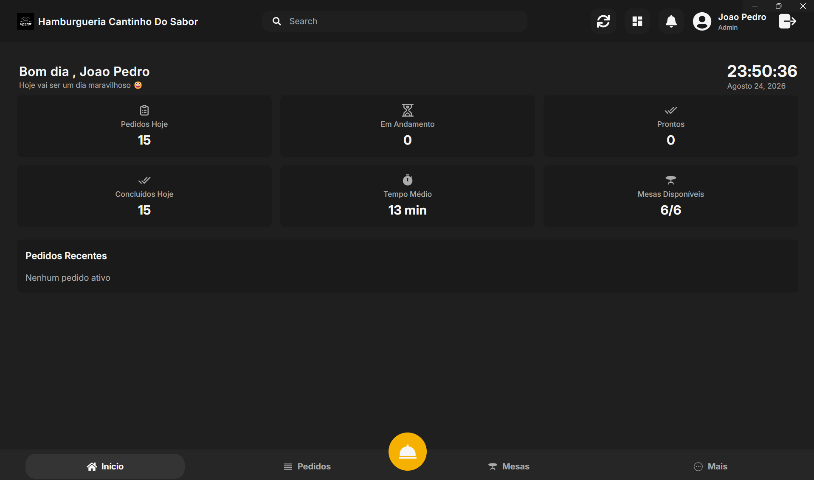
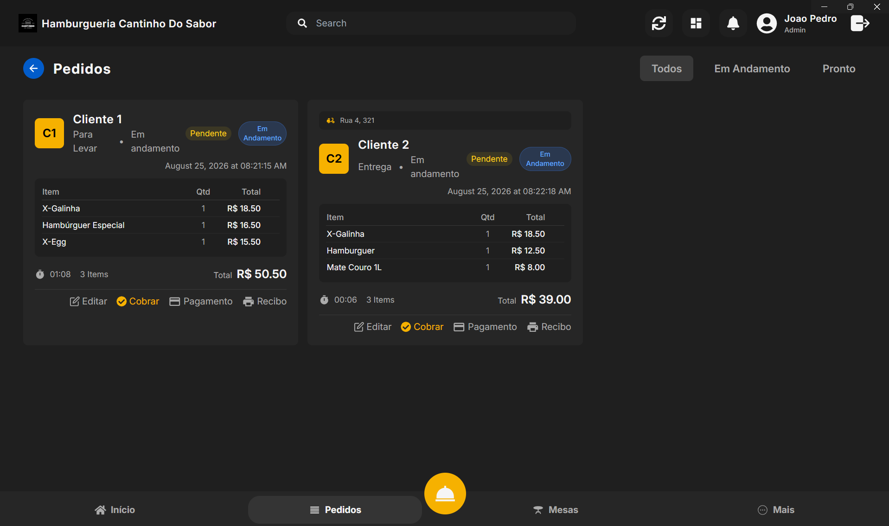
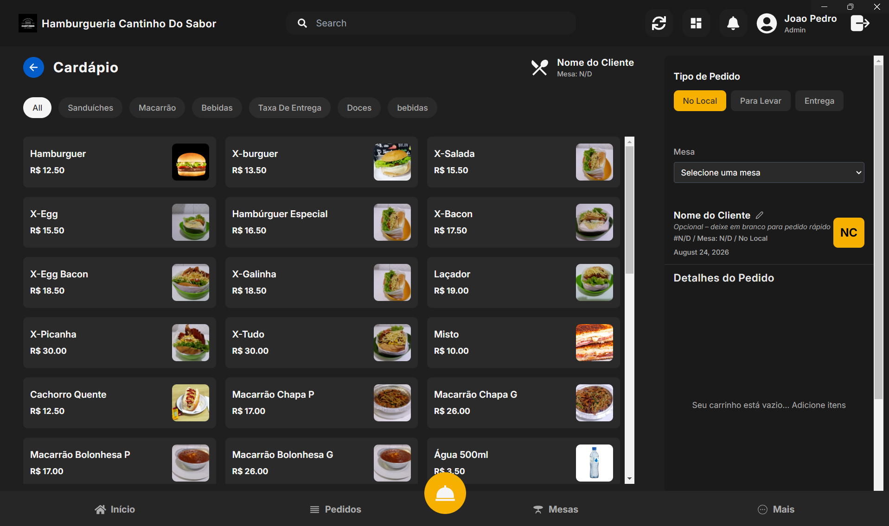
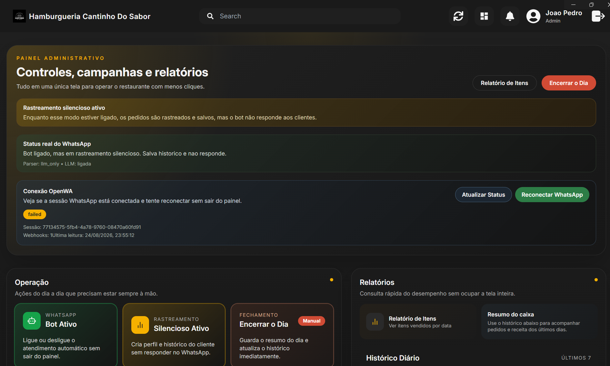
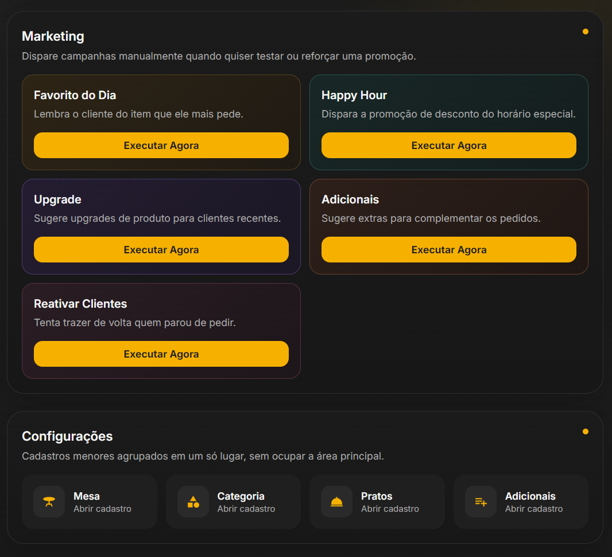
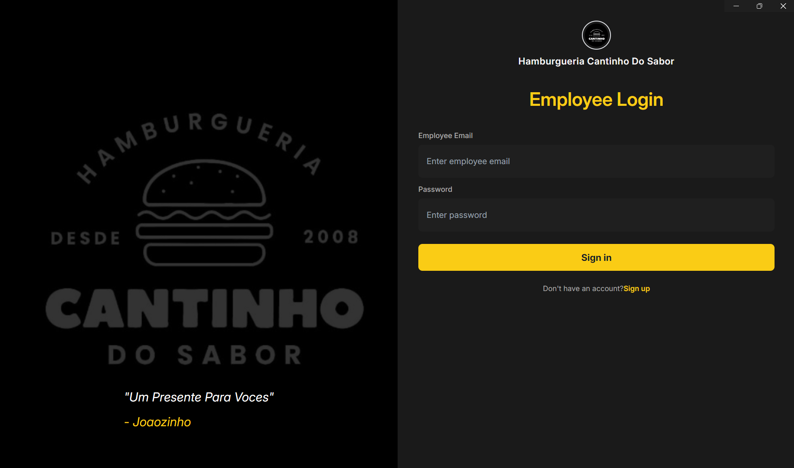

# Restaurant POS System

> A full-stack restaurant POS with a WhatsApp ordering assistant, built for the day-to-day flow of **Hamburgueria Cantinho do Sabor**.

Manage tables, orders, payments, products, daily closing, and customer campaigns from one desktop-friendly dashboard. Customers can also place an order through WhatsApp: the bot understands the message, sends the menu when asked, collects fulfilment and payment details, and saves the confirmed order straight into the POS.

<p align="center">
  
</p>

## Features

- **Fast POS workflow** — manage orders, tables, menu items, additions, payments, receipts, and daily summaries.
- **WhatsApp ordering bot** — accepts natural messages such as `2 X-Bacon, 1 Coca` and guides customers from order to confirmation.
- **Menu delivery** — replies to `cardápio` or `menu` with the restaurant’s menu image.
- **Hybrid item recognition** — tries deterministic keyword matching first, then uses a local Ollama model as a fallback.
- **Delivery-aware checkout** — asks for fulfilment type, delivery address when needed, and payment method.
- **Customer marketing** — includes campaigns for favourite items, happy hour, upgrades, additions, and reactivation.
- **Daily operations** — captures daily revenue and payment totals at midnight in the `America/Sao_Paulo` timezone.
- **Desktop-ready** — can be packaged as an Electron application for a native POS experience.

## Application preview

| Home dashboard | Orders |
| --- | --- |
|  |  |
| **POS menu** | **Administrative centre** |
|  |  |
| **Marketing & configuration** | **Employee login** |
|  |  |

## Architecture

```text
WhatsApp customer
        │
        ▼
 OpenWA gateway ── webhook ──► Express API ──► MongoDB
                                  │       │
                                  │       └── Ollama (optional fallback)
                                  ▼
                            React POS dashboard
                                  │
                                  └── Electron desktop wrapper (optional)
```

| Area | Technology |
| --- | --- |
| API | Node.js, Express, Mongoose, node-cron |
| POS dashboard | React, Vite, Redux, Tailwind CSS |
| Database | MongoDB |
| WhatsApp gateway | OpenWA via Docker |
| Optional AI fallback | Ollama local model |
| Desktop distribution | Electron |

## Quick start

### 1. Clone the project

```bash
git clone https://github.com/joaolopezs/ProjectJoaoterio2.0.git
cd ProjectJoaoterio2.0
```

### 2. Configure and start the API

```bash
cd pos-backend
npm install
```

Create `pos-backend/.env`. The values below are safe local-development examples; use your own secrets and WhatsApp session ID.

```env
PORT=3000
MONGODB_URI=mongodb://localhost:27017/pos-db
JWT_SECRET=replace-with-a-long-random-secret

OPENWA_URL=http://localhost:2785
OPENWA_API_KEY=dev-admin-key
OPENWA_SESSION_ID=your-openwa-session-id

OLLAMA_URL=http://localhost:11434
LLM_MODEL=qwen2.5:1.5b-instruct-q4_K_M
```

```bash
npm start
```

The API starts on `http://localhost:3000` and also serves a production frontend build when one is available.

### 3. Start the POS dashboard

In a second terminal:

```bash
cd pos-frontend
npm install
npm run dev
```

Open `http://localhost:5173`.

### 4. Start OpenWA

OpenWA is required to receive and reply to WhatsApp messages. With Docker running:

```bash
cd OpenWA
docker compose up -d
```

The local OpenWA API is exposed at `http://localhost:2785` by default. Create or connect a session, scan its QR code, and make sure the session ID matches `OPENWA_SESSION_ID` in the backend `.env` file. On startup, the backend registers this webhook when it is missing:

```text
http://host.docker.internal:3000/api/whatsapp/webhook
```

It listens for `message.received` events.

### 5. Enable local AI parsing (optional)

The bot still uses keyword matching without Ollama. To enable the fallback parser, install Ollama and pull the default model:

```bash
ollama pull qwen2.5:1.5b-instruct-q4_K_M
```

## WhatsApp order flow

```text
Message → item extraction → delivery / pickup → address (if delivery)
        → payment method → order summary → “sim” confirmation → POS order
```

1. A customer sends a greeting, a menu request, or an order message.
2. The bot recognises products and additions by keywords; it uses Ollama when necessary.
3. It asks whether the order is for dine-in, takeaway, or delivery.
4. For deliveries, it asks for a complete address; it then collects payment details.
5. The customer receives a summary and confirms with `sim`.
6. The confirmed order is persisted in MongoDB and becomes visible in the POS dashboard.

Replying with `não` lets the customer adjust the order without starting again. Sending `cardápio` or `menu` sends the menu image.

## Configuration

| Variable | Purpose | Local default |
| --- | --- | --- |
| `PORT` | Backend port | `3000` |
| `MONGODB_URI` | MongoDB connection string | `mongodb://localhost:27017/pos-db` |
| `JWT_SECRET` | Authentication signing secret | Required for production |
| `OPENWA_URL` | OpenWA API URL | `http://localhost:2785` |
| `OPENWA_API_KEY` | OpenWA API key | `dev-admin-key` |
| `OPENWA_SESSION_ID` | Connected WhatsApp session | Required for automated messaging |
| `OLLAMA_URL` | Ollama host URL | `http://localhost:11434` |
| `LLM_MODEL` | Ollama fallback model | `qwen2.5:1.5b-instruct-q4_K_M` |
| `MENU_IMAGE_URL` | Public URL for the WhatsApp menu image | `/public/images/cardapio.jpeg` on the API host |

> Never commit a populated `.env` file. Rotate any credentials that have been exposed outside your local environment.

## Customization

- **Products and additions:** maintain them through the POS dashboard or MongoDB collections.
- **Menu image:** replace [`pos-backend/public/images/cardapio.jpeg`](pos-backend/public/images/cardapio.jpeg) and set `MENU_IMAGE_URL` if it needs to be publicly reachable from OpenWA.
- **LLM instructions:** adjust the extraction prompt in [`pos-backend/utils/llmParser.js`](pos-backend/utils/llmParser.js).
- **Casual WhatsApp responses:** update the reply helper in [`pos-backend/utils/Whatsapphelpers.js`](pos-backend/utils/Whatsapphelpers.js).
- **Daily timezone:** scheduled summaries and marketing jobs use `America/Sao_Paulo`; update the cron settings if the restaurant operates elsewhere.

## Build the desktop application

After building the frontend, package the Electron wrapper:

```bash
cd pos-frontend
npm run build

cd ../electron-app
npm install
npm run dist
```

The packaged app is written to `electron-app/dist/`.

## Project structure

```text
Restaurant_POS_System/
├── pos-backend/       # Express API, WhatsApp bot, models, cron jobs
├── pos-frontend/      # React POS dashboard
├── electron-app/      # Desktop application wrapper
├── OpenWA/            # OpenWA Docker configuration and source
└── docs/images/       # Product screenshots used by this README
```

## Prerequisites

- Node.js 18+
- MongoDB (local or hosted)
- Docker (for the supplied OpenWA setup)
- [Ollama](https://ollama.com/) — optional, for natural-language fallback parsing

## License

This project is intended for internal restaurant use. Modify and distribute it as needed.

Built for João Pedro’s Restaurant 🍔
